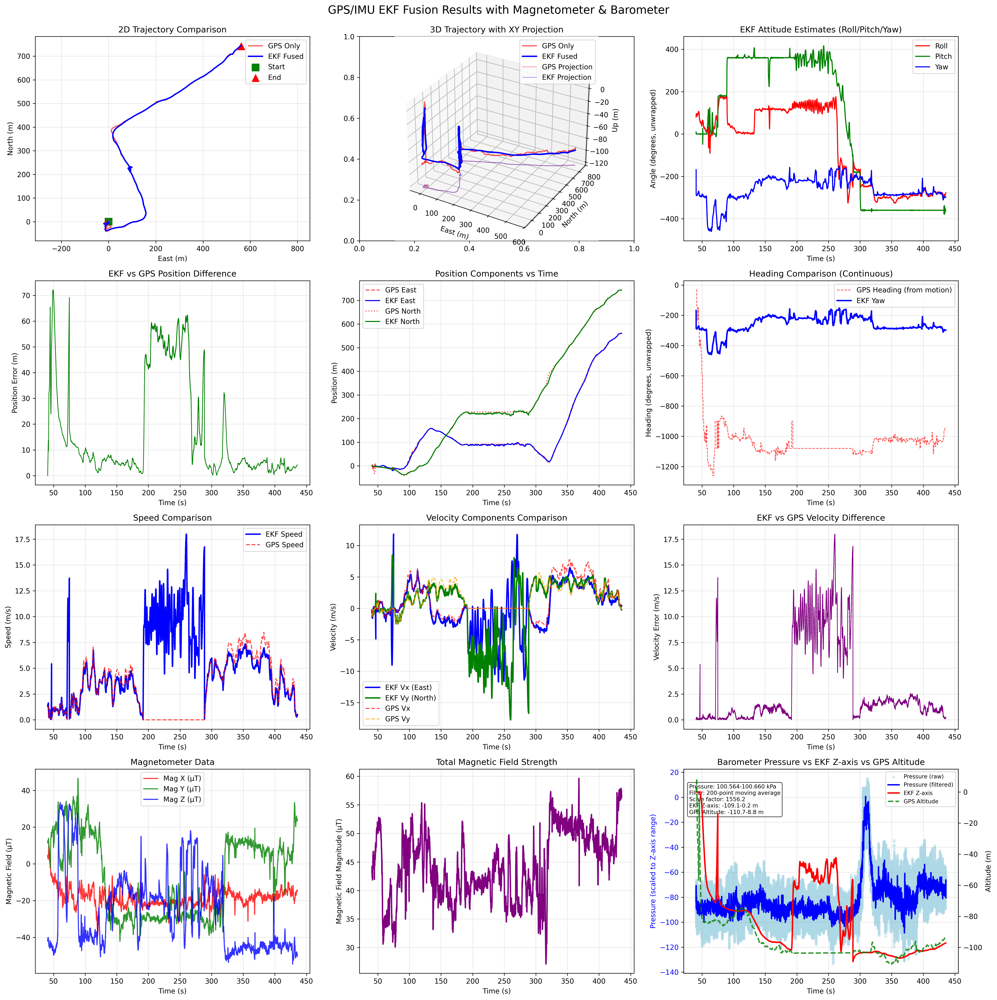

# Project Aria GPS/IMU EKF Fusion | Project Aria GPS/IMU EKF融合系统

[English](#english) | [中文](#中文)

---

## English

### Overview

A comprehensive multi-sensor fusion odometry system for Project Aria VRS files, implementing Extended Kalman Filter (EKF) to fuse GPS/IMU sensor data with optional magnetometer and barometer integration. This system provides robust state estimation for position, velocity, and attitude with advanced visualization capabilities.

### Features

- **Multi-Sensor Fusion**: GPS, IMU, magnetometer, and barometer data integration
- **Extended Kalman Filter**: 9-DOF state estimation [x, y, z, vx, vy, vz, roll, pitch, yaw]
- **Intelligent GPS Processing**: Automatic GPS altitude anomaly detection and stable start point selection
- **Adaptive Covariance**: GPS vertical accuracy integration for improved Z-axis estimation
- **Sensor Calibration**: Automatic IMU extrinsics estimation and gyroscope bias compensation
- **Advanced Visualization**: Comprehensive plotting with trajectory comparison, sensor data analysis, and accuracy metrics
- **Robust Data Processing**: Data cleaning, synchronization, and interpolation with error handling

### Installation

#### Prerequisites

```bash
# Install Project Aria Tools
pip install projectaria_tools

# Install dependencies
pip install numpy scipy matplotlib
```

#### Setup

1. Clone the repository:
```bash
git clone <repository-url>
cd aria_ekf_fusion
```

2. Install requirements:
```bash
pip install -r requirements.txt
```

### Usage

#### Basic Usage

```bash
python main.py path/to/file.vrs
```

#### Advanced Options

```bash
# Custom downsample factor
python main.py data.vrs --downsample 2

# Custom output prefix
python main.py data.vrs --out-prefix my_results

# Full example
python main.py data.vrs --downsample 2 --out-prefix trajectory_analysis
```

#### Command Line Arguments

- `vrs_path`: Path to the Project Aria VRS file (required)
- `--downsample`: Downsample factor for data processing (default: 1)
- `--out-prefix`: Output file prefix for results (default: "ekf_fusion")

### System Architecture

```
┌─────────────────┐    ┌──────────────────┐    ┌─────────────────┐
│   VRS File      │ -> │  Sensor Readers  │ -> │  Data Cleaning  │
│  (Aria Data)    │    │  GPS/IMU/Mag/Baro│    │  & Validation   │
└─────────────────┘    └──────────────────┘    └─────────────────┘
                                                         │
┌─────────────────┐    ┌──────────────────┐    ┌─────────────────┐
│  Visualization  │ <- │   EKF Fusion     │ <- │  Synchronization│
│  & Analysis     │    │   Pipeline       │    │  & Interpolation│
└─────────────────┘    └──────────────────┘    └─────────────────┘
                                │
                       ┌──────────────────┐
                       │   Calibration    │
                       │  (Extrinsics &   │
                       │  Bias Estimation)│
                       └──────────────────┘
```

### Key Components

#### 1. Sensor Data Processing
- **GPS Reader**: Position, velocity, and accuracy extraction with intelligent velocity direction estimation
- **IMU Reader**: Accelerometer and gyroscope data processing
- **Magnetometer Reader**: Magnetic field data for heading corrections
- **Barometer Reader**: Pressure and temperature data for altitude constraints

#### 2. Extended Kalman Filter
- **State Vector**: [position(3), velocity(3), attitude(3)]
- **Prediction Step**: IMU-driven state propagation with bias compensation
- **Update Steps**: GPS position/velocity, magnetometer heading, barometer relative height
- **Adaptive Noise**: GPS vertical accuracy integration for improved covariance

#### 3. Sensor Calibration
- **IMU Extrinsics**: Automatic estimation of IMU-to-world rotation matrix
- **Gyroscope Bias**: Statistical bias estimation and compensation
- **Gravity Alignment**: Accelerometer-based gravity vector estimation

#### 4. Visualization System
- **Trajectory Comparison**: 2D/3D GPS vs EKF trajectory visualization
- **Sensor Analysis**: Magnetometer, barometer, and accuracy data plots
- **Error Metrics**: Position, velocity, and attitude error statistics
- **Multi-sensor Correlation**: Barometer vs GPS vs EKF altitude comparison

### Output Files

The system generates comprehensive visualization:
- `{prefix}_ekf_comparison.png`: Complete sensor fusion analysis plots


*Example visualization showing GPS/IMU EKF fusion results with magnetometer and barometer data analysis*

### Technical Specifications

- **Coordinate System**: ENU (East-North-Up)
- **State Estimation**: 9-DOF Extended Kalman Filter
- **GPS Integration**: Position and velocity observations with adaptive covariance
- **IMU Integration**: High-frequency prediction with bias compensation
- **Sensor Rates**: Configurable update frequencies (GPS: 1/10 IMU rate, Magnetometer: 1/20 IMU rate)

### Mathematical Formulation

#### EKF State Vector
```
x = [px, py, pz, vx, vy, vz, roll, pitch, yaw]ᵀ
```
Where:
- `px, py, pz`: Position in ENU coordinates (m)
- `vx, vy, vz`: Velocity in ENU coordinates (m/s)
- `roll, pitch, yaw`: Euler angles (rad)

#### Prediction Step
**State Prediction:**
```
x_{k|k-1} = f(x_{k-1|k-1}, u_k, Δt)
```

**Position Update:**
```
p_{k|k-1} = p_{k-1|k-1} + v_{k-1|k-1} * Δt + 0.5 * a_world * Δt²
```

**Velocity Update:**
```
v_{k|k-1} = v_{k-1|k-1} + a_world * Δt
```

**Attitude Update:**
```
θ_{k|k-1} = θ_{k-1|k-1} + (ω_corrected - b_gyro) * Δt
```

**Acceleration Transformation:**
```
a_world = R(θ) * R_imu_to_world * (a_imu - b_accel) - g
```

Where:
- `R(θ)`: Rotation matrix from Euler angles
- `R_imu_to_world`: IMU extrinsics calibration matrix
- `g = [0, 0, -9.81]ᵀ`: Gravity vector in ENU
- `b_gyro, b_accel`: Gyroscope and accelerometer biases

#### Update Step (GPS)
**Observation Model:**
```
z_gps = H * x + v_gps
```

**Position-only observation:**
```
H_pos = [I₃ₓ₃  0₃ₓ₃  0₃ₓ₃]  (3×9 matrix)
```

**Position + Velocity observation:**
```
H_pos_vel = [I₃ₓ₃  0₃ₓ₃  0₃ₓ₃]  (6×9 matrix)
            [0₃ₓ₃  I₃ₓ₃  0₃ₓ₃]
```

**GPS Observation Covariance:**
```
R_gps = diag([σ²_h, σ²_h, σ²_v, σ²_vel, σ²_vel, σ²_vel])
```
Where:
- `σ²_h`: Horizontal accuracy squared
- `σ²_v`: Vertical accuracy squared (or 10×σ²_h if unavailable)
- `σ²_vel`: Velocity accuracy squared

#### Magnetometer Update
**Magnetic Heading Observation:**
```
ψ_mag = atan2(m_y, m_x) + δ_mag
```

Where:
- `m_x, m_y`: Magnetic field components in aligned frame
- `δ_mag`: Magnetic declination correction

**Observation Model:**
```
H_mag = [0  0  0  0  0  0  0  0  1]  (1×9 matrix)
```

#### Process Noise Model
**Convergence Phase (first 10s):**
```
Q_convergence = diag([0.05, 0.05, 0.05, 0.5, 0.5, 0.5, 0.1, 0.1, 0.1])
```

**Normal Operation:**
```
Q_normal = diag([0.01, 0.01, 0.01, 0.1, 0.1, 0.1, 0.01, 0.01, 0.01])
```

#### Coordinate Transformations
**GPS to Local ENU:**
```
[E]   [         0           ]   [Δλ * cos(φ₀) * R_earth]
[N] = [         0           ] + [Δφ * R_earth           ]
[U]   [h - h₀              ]   [         0              ]
```

Where:
- `φ₀, λ₀, h₀`: Origin latitude, longitude, altitude
- `Δφ, Δλ`: Latitude/longitude differences
- `R_earth ≈ 6378137 m`: Earth radius

**Gravity Model (WGS84):**
```
g(φ) = 9.780318 * (1 + 5.3024×10⁻³ * sin²(φ) - 5.8×10⁻⁶ * sin²(2φ))
```

### Example Output

After successful execution:
```
正在处理 VRS 文件: data.vrs
GPS数据点数: 1250
EKF融合完成，生成 12500 个数据点

EKF融合结果统计:
  平均位置误差: 2.34 m
  位置误差标准差: 1.87 m
  最大位置误差: 8.92 m
  轨迹总长度 (GPS): 1247.3 m
  轨迹总长度 (EKF): 1251.8 m

完成！生成文件:
  ekf_fusion_ekf_comparison.png
```

---

## 中文

### 概述

面向Project Aria VRS文件的综合多传感器融合里程计系统，采用扩展卡尔曼滤波器(EKF)融合GPS/IMU传感器数据，可选集成磁力计和气压计。该系统为位置、速度和姿态提供鲁棒的状态估计，具备先进的可视化功能。

### 主要特性

- **多传感器融合**：GPS、IMU、磁力计和气压计数据集成
- **扩展卡尔曼滤波**：9自由度状态估计 [x, y, z, vx, vy, vz, roll, pitch, yaw]
- **智能GPS处理**：自动GPS高度异常检测和稳定起点选择
- **自适应协方差**：GPS垂直精度集成，改善Z轴估计
- **传感器标定**：自动IMU外参估计和陀螺仪偏置补偿
- **高级可视化**：包含轨迹对比、传感器数据分析和精度指标的综合绘图
- **鲁棒数据处理**：数据清理、同步和插值，具备错误处理机制

### 安装

#### 前置要求

```bash
# 安装 Project Aria Tools
pip install projectaria_tools

# 安装依赖
pip install numpy scipy matplotlib
```

#### 设置

1. 克隆仓库：
```bash
git clone <repository-url>
cd aria_ekf_fusion
```

2. 安装依赖：
```bash
pip install -r requirements.txt
```

### 使用方法

#### 基本用法

```bash
python main.py path/to/file.vrs
```

#### 高级选项

```bash
# 自定义降采样因子
python main.py data.vrs --downsample 2

# 自定义输出前缀
python main.py data.vrs --out-prefix my_results

# 完整示例
python main.py data.vrs --downsample 2 --out-prefix trajectory_analysis
```

#### 命令行参数

- `vrs_path`：Project Aria VRS文件路径（必需）
- `--downsample`：数据处理降采样因子（默认：1）
- `--out-prefix`：结果输出文件前缀（默认："ekf_fusion"）

### 系统架构

```
┌─────────────────┐    ┌──────────────────┐    ┌─────────────────┐
│   VRS文件       │ -> │   传感器读取器    │ -> │   数据清理      │
│  (Aria数据)     │    │  GPS/IMU/磁/气压 │    │   和验证        │
└─────────────────┘    └──────────────────┘    └─────────────────┘
                                                         │
┌─────────────────┐    ┌──────────────────┐    ┌─────────────────┐
│   可视化和      │ <- │   EKF融合        │ <- │   同步和        │
│   分析          │    │   管道           │    │   插值          │
└─────────────────┘    └──────────────────┘    └─────────────────┘
                                │
                       ┌──────────────────┐
                       │     标定         │
                       │  (外参和偏置     │
                       │    估计)         │
                       └──────────────────┘
```

### 核心组件

#### 1. 传感器数据处理
- **GPS读取器**：位置、速度和精度提取，智能速度方向估计
- **IMU读取器**：加速度计和陀螺仪数据处理
- **磁力计读取器**：用于航向修正的磁场数据
- **气压计读取器**：用于高度约束的压力和温度数据

#### 2. 扩展卡尔曼滤波器
- **状态向量**：[位置(3), 速度(3), 姿态(3)]
- **预测步骤**：基于IMU的状态传播，带偏置补偿
- **更新步骤**：GPS位置/速度、磁力计航向、气压计相对高度
- **自适应噪声**：GPS垂直精度集成，改善协方差

#### 3. 传感器标定
- **IMU外参**：自动估计IMU到世界坐标系旋转矩阵
- **陀螺仪偏置**：统计偏置估计和补偿
- **重力对齐**：基于加速度计的重力向量估计

#### 4. 可视化系统
- **轨迹对比**：2D/3D GPS与EKF轨迹可视化
- **传感器分析**：磁力计、气压计和精度数据图表
- **误差指标**：位置、速度和姿态误差统计
- **多传感器关联**：气压计vs GPS vs EKF高度对比

### 输出文件

系统生成综合可视化结果：
- `{prefix}_ekf_comparison.png`：完整的传感器融合分析图表


*示例可视化：GPS/IMU EKF融合结果，包含磁力计和气压计数据分析*

### 技术规格

- **坐标系统**：ENU（东-北-上）
- **状态估计**：9自由度扩展卡尔曼滤波器
- **GPS集成**：位置和速度观测，自适应协方差
- **IMU集成**：高频预测，带偏置补偿
- **传感器频率**：可配置更新频率（GPS：1/10 IMU频率，磁力计：1/20 IMU频率）

### 数学公式

#### EKF状态向量
```
x = [px, py, pz, vx, vy, vz, roll, pitch, yaw]ᵀ
```
其中：
- `px, py, pz`：ENU坐标系中的位置 (m)
- `vx, vy, vz`：ENU坐标系中的速度 (m/s)
- `roll, pitch, yaw`：欧拉角 (rad)

#### 预测步骤
**状态预测：**
```
x_{k|k-1} = f(x_{k-1|k-1}, u_k, Δt)
```

**位置更新：**
```
p_{k|k-1} = p_{k-1|k-1} + v_{k-1|k-1} * Δt + 0.5 * a_world * Δt²
```

**速度更新：**
```
v_{k|k-1} = v_{k-1|k-1} + a_world * Δt
```

**姿态更新：**
```
θ_{k|k-1} = θ_{k-1|k-1} + (ω_corrected - b_gyro) * Δt
```

**加速度坐标变换：**
```
a_world = R(θ) * R_imu_to_world * (a_imu - b_accel) - g
```

其中：
- `R(θ)`：欧拉角转旋转矩阵
- `R_imu_to_world`：IMU外参标定矩阵
- `g = [0, 0, -9.81]ᵀ`：ENU坐标系重力向量
- `b_gyro, b_accel`：陀螺仪和加速度计偏置

#### 更新步骤（GPS）
**观测模型：**
```
z_gps = H * x + v_gps
```

**仅位置观测：**
```
H_pos = [I₃ₓ₃  0₃ₓ₃  0₃ₓ₃]  (3×9 矩阵)
```

**位置+速度观测：**
```
H_pos_vel = [I₃ₓ₃  0₃ₓ₃  0₃ₓ₃]  (6×9 矩阵)
            [0₃ₓ₃  I₃ₓ₃  0₃ₓ₃]
```

**GPS观测协方差：**
```
R_gps = diag([σ²_h, σ²_h, σ²_v, σ²_vel, σ²_vel, σ²_vel])
```
其中：
- `σ²_h`：水平精度平方
- `σ²_v`：垂直精度平方（如不可用则为10×σ²_h）
- `σ²_vel`：速度精度平方

#### 磁力计更新
**磁航向观测：**
```
ψ_mag = atan2(m_y, m_x) + δ_mag
```

其中：
- `m_x, m_y`：对齐坐标系中的磁场分量
- `δ_mag`：磁偏角修正

**观测模型：**
```
H_mag = [0  0  0  0  0  0  0  0  1]  (1×9 矩阵)
```

#### 过程噪声模型
**收敛阶段（前10秒）：**
```
Q_convergence = diag([0.05, 0.05, 0.05, 0.5, 0.5, 0.5, 0.1, 0.1, 0.1])
```

**正常运行：**
```
Q_normal = diag([0.01, 0.01, 0.01, 0.1, 0.1, 0.1, 0.01, 0.01, 0.01])
```

#### 坐标变换
**GPS到局部ENU：**
```
[E]   [         0           ]   [Δλ * cos(φ₀) * R_earth]
[N] = [         0           ] + [Δφ * R_earth           ]
[U]   [h - h₀              ]   [         0              ]
```

其中：
- `φ₀, λ₀, h₀`：原点纬度、经度、高度
- `Δφ, Δλ`：纬度/经度差值
- `R_earth ≈ 6378137 m`：地球半径

**重力模型（WGS84）：**
```
g(φ) = 9.780318 * (1 + 5.3024×10⁻³ * sin²(φ) - 5.8×10⁻⁶ * sin²(2φ))
```

### 示例输出

运行成功后，系统将输出：
```
正在处理 VRS 文件: data.vrs
GPS数据点数: 1250
EKF融合完成，生成 12500 个数据点

EKF融合结果统计:
  平均位置误差: 2.34 m
  位置误差标准差: 1.87 m
  最大位置误差: 8.92 m
  轨迹总长度 (GPS): 1247.3 m
  轨迹总长度 (EKF): 1251.8 m

完成！生成文件:
  ekf_fusion_ekf_comparison.png
```

### 故障排除

1. **VRS文件无法打开**：检查文件路径和Project Aria Tools安装
2. **传感器数据缺失**：验证VRS文件包含所需的传感器流
3. **内存不足**：使用`--downsample`参数减少数据量
4. **GPS异常跳变**：系统自动检测并跳过不稳定的GPS起点

### 贡献

欢迎提交问题报告和功能请求。对于代码贡献，请确保：
- 遵循现有代码风格
- 添加适当的文档和注释
- 测试您的更改

---

## Contact | 联系方式

For questions and support | 如有问题和支持需求:
- Create an issue in the repository | 在仓库中创建issue